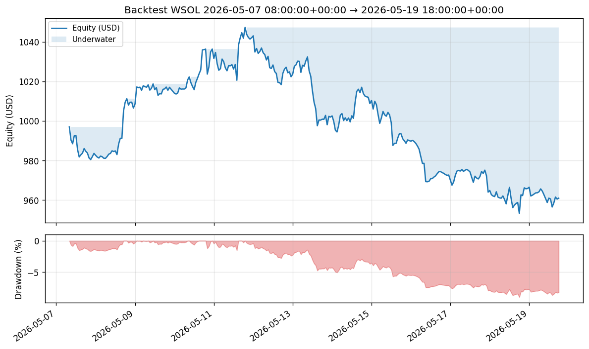

# PM Report — (all)

_Generated 2026-05-20T12:59:19.340760+00:00_  
Audit source: `/home/paulomcg/Projects/strategy-backtester/state/runs/20260520T125805Z-1ccf95/pm-state/audit.jsonl`  
Cycles: **299**  Bars used: **299**  Inferred periods/year: **8760**

## Headline metrics

| Metric | Value |
|---|---|
| Initial equity (USD) | 997.00 |
| Final equity (USD) | 961.02 |
| Total return | -3.61% |
| CAGR | -66.06% |
| Sharpe | -3.3569 |
| Sortino | -4.7570 |
| Calmar | -7.3572 |
| Max drawdown | 8.98% |

## Trade activity

| Field | Value |
|---|---|
| Closed trades | 23 |
| Winners | 18 |
| Losers | 3 |
| Win rate | 78.26% |
| Expectancy / trade (USD) | -0.10 |
| Total realized PnL (USD) | -2.35 |

## Realized PnL by asset

| Asset | PnL (USD) |
|---|---|
| WSOL | -2.35 |

